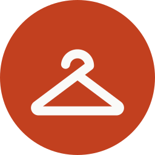
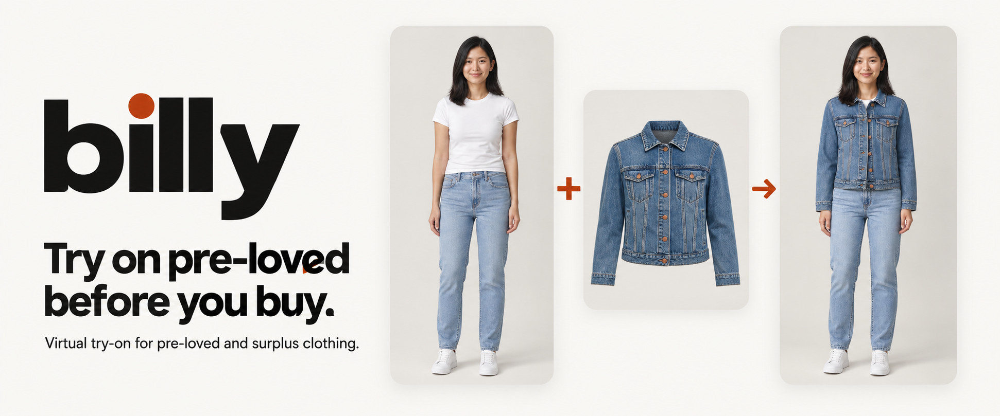
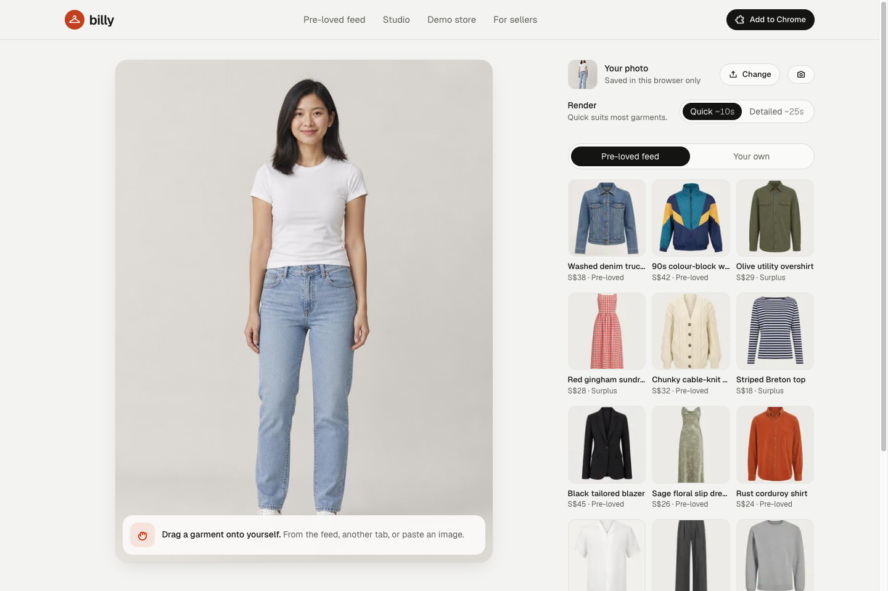
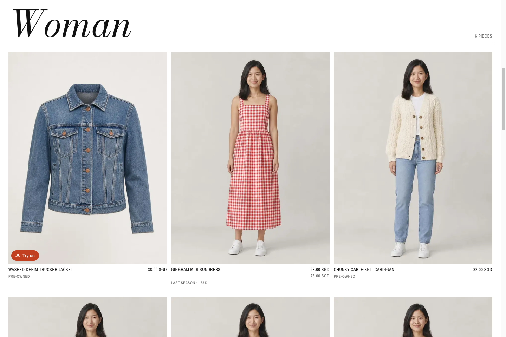
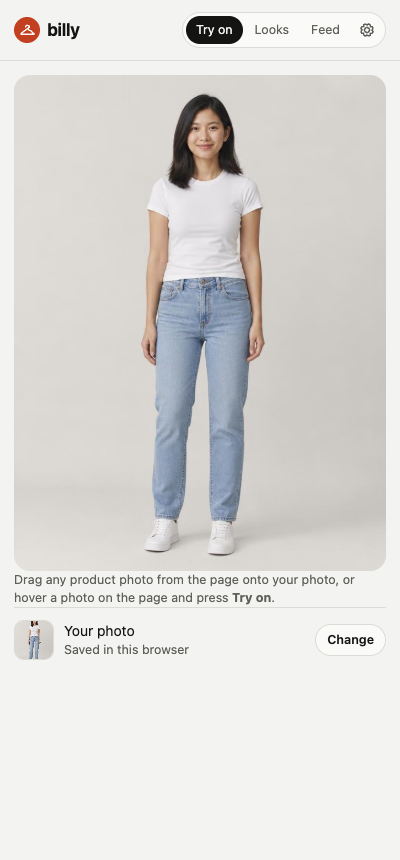

<a id="readme-top"></a>

<div align="center">
  <a href="https://billy-try-on.vercel.app">
    
  </a>
  <h1>Billy</h1>
  <p>Virtual try-on for pre-loved and surplus clothing.</p>
  <p>
    <a href="https://billy-try-on.vercel.app/studio"><strong>Try the Studio</strong></a>
    · <a href="https://billy-try-on.vercel.app/extension">Add to Chrome</a>
    · <a href="docs/DEVELOPMENT.md">Explore the docs</a>
    · <a href="https://github.com/Ducksss/billy-try-on/issues">Report a bug or request a feature</a>
  </p>
  <p>
    <a href="https://github.com/Ducksss/billy-try-on/stargazers"></a>
    <a href="https://github.com/Ducksss/billy-try-on/issues"></a>
    <a href="extension/manifest.json"></a>
    <a href="#privacy-and-known-limits"></a>
  </p>
</div>

[](https://billy-try-on.vercel.app)

<details>
  <summary>Table of contents</summary>
  <ol>
    <li><a href="#about-the-project">About the project</a>
      <ul><li><a href="#built-with">Built with</a></li></ul>
    </li>
    <li><a href="#getting-started">Getting started</a>
      <ul>
        <li><a href="#prerequisites">Prerequisites</a></li>
        <li><a href="#installation">Installation</a></li>
      </ul>
    </li>
    <li><a href="#usage">Usage</a></li>
    <li><a href="#development">Development</a></li>
    <li><a href="#privacy-and-known-limits">Privacy and known limits</a></li>
    <li><a href="#roadmap">Roadmap</a></li>
    <li><a href="#contributing">Contributing</a></li>
    <li><a href="#license">License</a></li>
    <li><a href="#contact">Contact</a></li>
    <li><a href="#acknowledgments">Acknowledgments</a></li>
  </ol>
</details>

## About the project

Billy lets shoppers see a garment on themselves before buying. Add a full-length photo, choose a garment from a listing or shop, then save and compare the generated looks. It works in a web Studio, in Chrome's side panel and inside a fictional retailer demo called ÉTAGE.

- **Try clothes from another shop.** Hover, drag or right-click a product photo with the Chrome extension, or upload an image or paste an image link into the Studio.
- **Build an outfit.** Keep a piece on and layer another garment over the finished look.
- **Compare before deciding.** Save looks, rate whether you would buy them, compare two side by side and share or download a preview.
- **Choose the render quality.** Quick and Detailed modes show partial previews when the image provider returns them.
- **See the retailer flow.** The demo store includes product pages, an embedded Billy drawer and a local shopping bag.
- **Use an optional live mirror.** A Decart key enables camera-based video try-on, still captures and short recordings.

[](https://billy-try-on.vercel.app/studio)

The Studio screenshot uses an AI-generated example model. The cover is generated editorial artwork, not an app screenshot. All catalogue photos, showcase looks, models, sellers and prices are demo content, and ÉTAGE checkout is disabled. A preview shows appearance rather than verified physical fit.

Billy was built for SDG 12, responsible consumption, with the aim of making pre-loved and surplus clothing easier to evaluate. Environmental and purchase-confidence benefits have not been measured. The [pitch deck and presenter notes](docs/slides/README.md) explain the prototype and a proposed shopper pilot.

### Built with

[![Next.js][next-shield]][next-url]
[![React][react-shield]][react-url]
[![TypeScript][typescript-shield]][typescript-url]
[![Tailwind CSS][tailwind-shield]][tailwind-url]

The web app uses Next.js 16 and React 19. The Chrome extension is plain JavaScript with no build step. OpenAI handles photo try-on by default, Gemini is an alternative provider, and the optional live mirror uses the Decart SDK. See [configuration and provider details](docs/DEVELOPMENT.md#configuration).

<p align="right"><a href="#readme-top">Back to top ↑</a></p>

## Getting started

### Prerequisites

- Node.js **20.9 or later** and npm.
- An OpenAI API key with image generation access and available credits for live photo try-on. Browsing and the landing page's pre-rendered demo work without a key.
- Chrome **116 or later** to use the extension.
- Optional Gemini or Decart credentials for those providers.

### Installation

1. Clone the project and install both sets of dependencies.

   ```sh
   git clone https://github.com/Ducksss/billy-try-on.git
   cd billy-try-on
   npm ci
   npm --prefix web ci
   ```

2. Copy the example configuration.

   ```sh
   cp web/.env.example web/.env.local
   ```

   Add your key to `web/.env.local`:

   ```dotenv
   OPENAI_API_KEY=your_key_here
   ```

   Keep this file local. [The configuration guide](docs/DEVELOPMENT.md#configuration) covers provider selection, render quality, rate limits and the optional live mirror.

3. Start the web app from the repository root.

   ```sh
   npm run dev
   ```

   Open [localhost:3000](http://localhost:3000). The demo images are already committed, so asset generation is not needed for setup.

4. Load the extension if you want to try clothes on other sites.

   Open `chrome://extensions`, enable **Developer mode**, choose **Load unpacked** and select this repository's `extension/` folder. Click Billy in the toolbar to open the side panel. This copy connects to `http://localhost:3000` by default, and the panel's gear icon lets you change the server.

   For the hosted demo, [download the extension](https://billy-try-on.vercel.app/extension), unzip it and load the extracted `billy-extension/` folder the same way. The download connects to the hosted server.

<p align="right"><a href="#readme-top">Back to top ↑</a></p>

## Usage

1. Open the **Studio** or Chrome side panel and upload a full-length photo, use the camera or borrow an AI-generated example model.
2. Pick a piece from the feed, upload a garment, paste its image link or use the extension on a product photo.
3. Choose **Quick** or **Detailed** and run a try-on. Each live generation uses the configured provider's API credits.
4. Save the look and answer **Would you buy it?**, drag the comparison handle, or choose **Keep it on** to add another piece.
5. Compare saved looks side by side or use the share and download controls.

| Surface | What to try |
| --- | --- |
| [Studio](https://billy-try-on.vercel.app/studio) | Photo try-on, outfit layering, saved looks and comparisons |
| [Pre-loved feed](https://billy-try-on.vercel.app/discover) | Twelve fictional pre-loved and surplus listings |
| [Chrome extension](https://billy-try-on.vercel.app/extension) | Hover **Try on**, drag a product image or choose **Try on with Billy** from its right-click menu |
| [ÉTAGE demo store](https://billy-try-on.vercel.app/shop) | Embedded try-on, product photos marked **On you** and a local shopping bag |
| [Live mirror](https://billy-try-on.vercel.app/mirror) | Camera try-on when the deployment has a Decart key |

<details>
  <summary>See the demo store and Chrome side panel</summary>
  <p><a href="https://billy-try-on.vercel.app/shop"></a></p>
  <p></p>
  <p>The store image is a browser capture. The extension image is existing end-to-end test evidence using an AI-generated example model.</p>
</details>

## Development

Run these commands from the repository root:

| Command | Purpose |
| --- | --- |
| `npm run dev` | Start the local Next.js app |
| `npm --prefix web run lint` | Check the web source with ESLint |
| `npm --prefix web run build` | Build the production web app |
| `npm run test:extension -- --skip-generate` | Test the extension with mocked rendering while the local app is running |
| `npm run assets` | Generate missing catalogue and model photos, using API credits |
| `npm run looks` | Generate missing showcase looks through the running app, using API credits |
| `npm run pack:extension` | Rebuild the extension download with the hosted server URL |

The [development guide](docs/DEVELOPMENT.md) covers the repository layout, API, storage, tests, packing and deployment. The [asset guide](docs/assets/README.md) contains the cover and share-card prompts, screenshot sources and reusable image files.

<p align="right"><a href="#readme-top">Back to top ↑</a></p>

## Privacy and known limits

- Photos and saved looks persist in the browser, in IndexedDB for the web app and `chrome.storage.local` for the extension. Clearing browser data removes them.
- The browser normalises uploaded photos and strips EXIF metadata. A live try-on sends the person and garment images through Billy's server to the configured image provider. Billy does not persist them on its server, and provider handling is separate.
- The live mirror sends camera video to Decart. Its sessions are capped at two minutes and stop when the tab is hidden.
- The public try-on endpoint incurs provider costs. Its per-IP rate limit is in memory, resets on restart or deployment and applies separately to each server instance.
- The remote garment fetch guard checks hostnames, rather than resolved IPs, and follows redirects. It needs further protection before use with untrusted traffic at scale.
- The extension requests `<all_urls>` to read product images across shops.
- Gemini and a real Decart mirror session still need provider validation. The extension's right-click menu and opening its native side panel from a page need manual Chrome checks.

[Further details](docs/DEVELOPMENT.md#known-limits) are in the development guide.

## Roadmap

- [x] Web Studio and Chrome Manifest V3 extension
- [x] Quick and Detailed renders with streamed previews
- [x] Outfit layering, saved looks, verdicts and comparisons
- [x] Retailer demo with embedded try-on
- [x] Optional live mirror implementation
- [ ] Validate Gemini and the live mirror with funded provider accounts
- [ ] Connect real seller feeds and retailer surplus stock
- [ ] Export verdicts and run the proposed shopper pilot
- [ ] Strengthen public API cost controls and remote-image fetching
- [ ] Explore phone-as-camera and video previews from saved looks

Track proposals and bugs in the [project issues](https://github.com/Ducksss/billy-try-on/issues).

## Contributing

Open an issue to discuss a larger change, or fork the repository and submit a focused pull request. Use a branch such as `PinZheng/studio-comparison`, keep API keys out of commits, and run lint, the production build and the relevant tests. For UI changes, check both a desktop and a phone-sized viewport. After changing `extension/`, repack its download so the hosted ZIP stays in sync.

Include the problem, the resulting behaviour and the checks you ran in your pull request. Use a title such as `docs(docs): improve setup instructions` and add screenshots when the UI changes.

## License

This repository currently has no licence file. Reuse and redistribution terms have not been specified. Contact the maintainer before redistributing the project.

## Contact

Maintainer: [Ducksss on GitHub](https://github.com/Ducksss). Use [project issues](https://github.com/Ducksss/billy-try-on/issues) for questions, bug reports and feature requests.

## Acknowledgments

- [Best-README-Template](https://github.com/othneildrew/Best-README-Template) for the README structure.
- [Anywear](https://anywear.decart.ai/) for the live-camera try-on reference.
- [United Nations SDG 12](https://sdgs.un.org/goals/goal12) for the responsible consumption challenge.
- [Phosphor Icons](https://phosphoricons.com/), [Motion](https://motion.dev/) and [idb-keyval](https://github.com/jakearchibald/idb-keyval) for icons, animation and browser storage.
- [OpenAI](https://platform.openai.com/), [Google Gemini](https://ai.google.dev/) and [Decart](https://decart.ai/) for the image and realtime provider integrations.
- [Shields.io](https://shields.io/) for the project badges.

<p align="right"><a href="#readme-top">Back to top ↑</a></p>

[next-shield]: https://img.shields.io/badge/Next.js-141413?style=for-the-badge&logo=nextdotjs&logoColor=white
[next-url]: https://nextjs.org/
[react-shield]: https://img.shields.io/badge/React-141413?style=for-the-badge&logo=react&logoColor=61dafb
[react-url]: https://react.dev/
[typescript-shield]: https://img.shields.io/badge/TypeScript-141413?style=for-the-badge&logo=typescript&logoColor=3178c6
[typescript-url]: https://www.typescriptlang.org/
[tailwind-shield]: https://img.shields.io/badge/Tailwind_CSS-141413?style=for-the-badge&logo=tailwindcss&logoColor=06b6d4
[tailwind-url]: https://tailwindcss.com/
